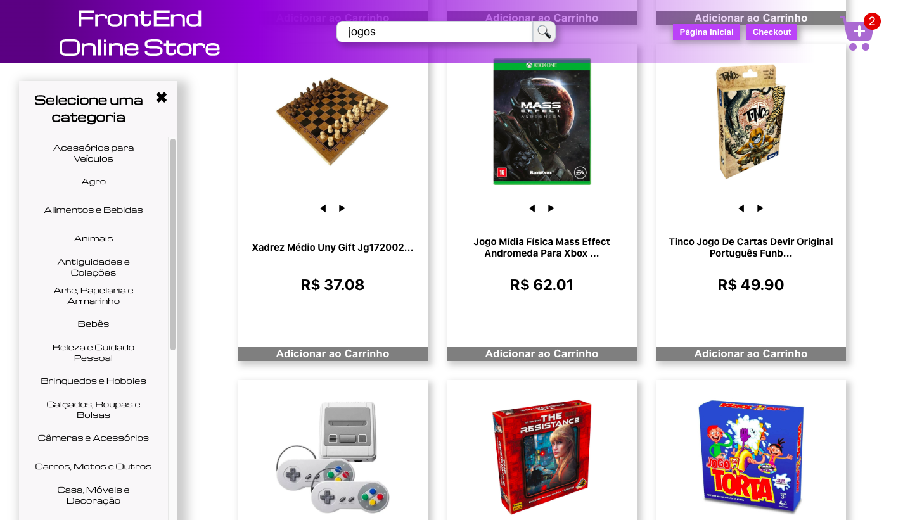

# Fontend Online Store Project

This project was created during the frontend module on Trybe course. The application consumes Mercado Livre's API to get products and display them. The user can search products either by name or category, visualize products details, add products to cart, buy them in different purchase methods and rate products.

## Used technologies

    HTML5, CSS3, JavaScript, ES6, React, React Router

## Running application

Clone this repository

    git clone
    
Install the dependencies

    cd Frontend-Online-Store && npm install
    
Run the application

    npm start
